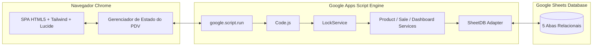

# Mercadinho Pro — architecture.md

## Visão Arquitetural

A plataforma adota o modelo **Serverless Monolith integrado ao ecossistema Google Workspace**, dividida entre:
1. **Frontend (SPA - Single Page Application):** HTML5, Tailwind CSS via CDN, Lucide Icons, Chart.js para renderização de gráficos e JavaScript Vanilla modularizado, servido pelo `HtmlService` do Google Apps Script.
2. **Backend (Google Apps Script Engine):** Scripts em JavaScript (V8 runtime) divididos em controladores (`Code.js`), adaptador de banco (`SheetDB.js`) e serviços de domínio (`ProductService.js`, `SaleService.js`, `DashboardService.js`).
3. **Database (Google Sheets Relational Store):** Planilha estruturada com 5 abas (`PRODUTOS`, `VENDAS`, `ITENS_VENDA`, `MOVIMENTACOES`, `CONFIG`).

## Containers e Arquivos da Aplicação

- `apps/mercadinho-appscript/Code.js`: Ponto de entrada do Web App (`doGet`), inclusão de templates e roteamento de chamadas remotas.
- `apps/mercadinho-appscript/SheetDB.js`: Gerenciamento do banco de dados na planilha, mapeamento de colunas, sanitização contra Formula Injection e controle de concorrência com `LockService`.
- `apps/mercadinho-appscript/ProductService.js`: CRUD de produtos, busca rápida por código de barras ou texto, e movimentação de inventário.
- `apps/mercadinho-appscript/SaleService.js`: Finalização atômica de vendas, baixa de estoque, geração de ID sequencial e montagem de dados para o cupom.
- `apps/mercadinho-appscript/DashboardService.js`: Agregação de dados financeiros, ticket médio, produtos mais vendidos e alertas de estoque baixo.
- `apps/mercadinho-appscript/Index.html`: Layout principal da aplicação.
- `apps/mercadinho-appscript/Styles.html`: Folhas de estilo, regras de animação e diretivas `@media print` para cupom térmico (80mm/58mm).
- `apps/mercadinho-appscript/Script.html`: Lógica reativa do cliente, atalhos de teclado (`F2`, `F4`, `Enter`), controle do carrinho e chamadas assíncronas `google.script.run`.
- `apps/mercadinho-appscript/ReceiptTemplate.html`: Componente de renderização do cupom de venda.
- `apps/mercadinho-appscript/appsscript.json`: Manifesto de permissões do Apps Script.

## Padrões Arquiteturais e de Concorrência

- **Isolamento de Concorrência:** Uso do `LockService.getScriptLock()` com timeout de 10.000 ms durante a gravação de vendas para prevenir race condition e duplicidade de baixa de estoque.
- **Sanitização de Células:** Toda string iniciada por `=`, `+`, `-`, `@` ou `\t` recebe prefixo de apóstrofo `'` antes de ser salva na planilha, neutralizando riscos de Formula Injection (CSV/Sheet Injection).
- **Auto-Setup e Migrações:** O adaptador `SheetDB` detecta automaticamente se a planilha possui as 5 abas e cabeçalhos corretos; se não possuir, cria e formata as abas na primeira execução.
